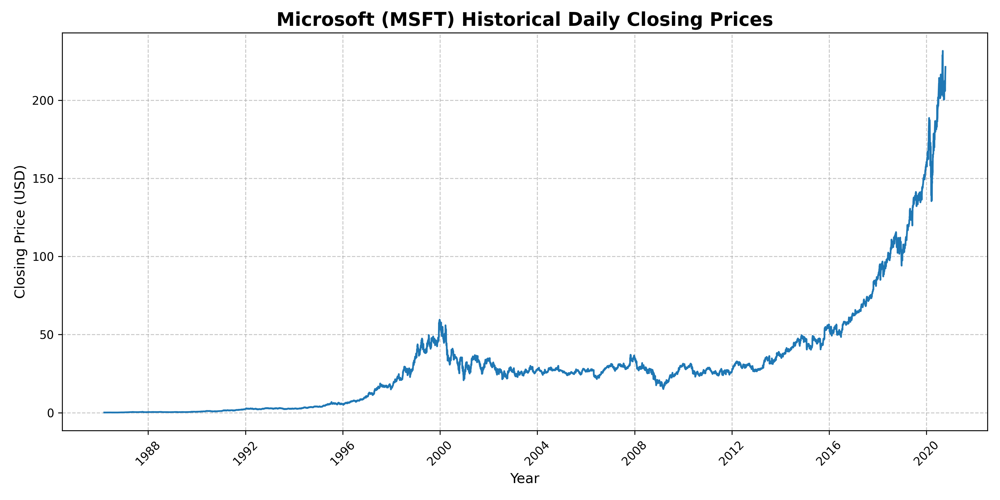
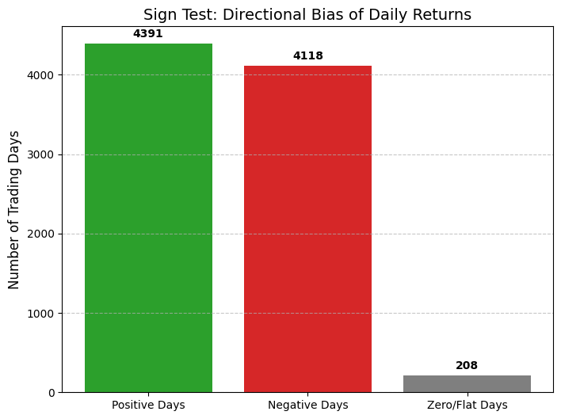
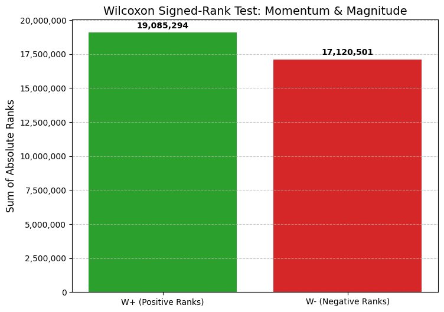
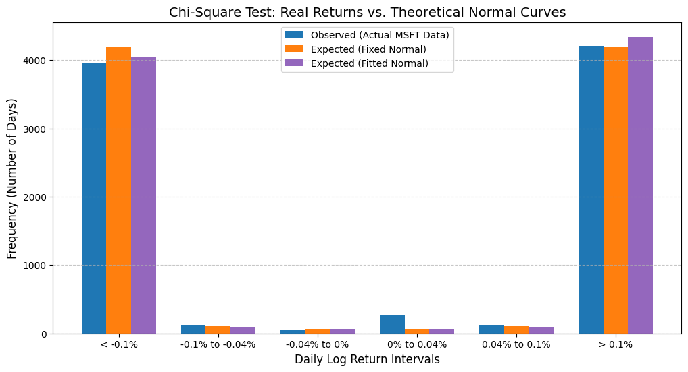

# Quantitative Analysis of Microsoft's Stock Returns (MSFT)
> **Evaluating the Random Walk Hypothesis (RWH) and structural market asymmetries using non-parametric and goodness-of-fit statistical tests.**

## Overview
Traditional financial models (like Geometric Brownian Motion) often rely on the assumption that stock log returns are normally distributed and symmetric. This project mathematically stress-tests these assumptions using over 34 years (8,717 trading days) of Microsoft (MSFT) stock data.
By implementing non-parametric tests to isolate directional momentum and goodness-of-fit models to evaluate distribution shapes, this tool provides definitive statistical proof of inherent directional bias and not-normal distribution shape in equity markets.

Fyi:

The Random Walk Hypothesis (RWH) is a financial theory which states that the prices of financial assets, particularly those in the stock market, follow a random walk. According to this hypothesis, price variations occur in an essentially random manner, which implies that they cannot be systematically predicted or consistently exploited to achieve returns above those of the overall market.

---

## Methodology
* **Language:** Python 3.x
* **Libraries:** `pandas`, `numpy`, `matplotlib`, `scipy.stats`, `math`
* **Implemented Tests:**
  * **Sign Test:** Evaluates directional price bias against a theoretical 50/50 random walk (p=0.5 for moving up or down).
  * **Wilcoxon Signed-Rank Test:** Incorporates the absolute magnitude of daily returns to detect structural asymmetry between positive and negative regimes.
  * **Chi-Square Goodness-of-Fit Test:** Compares empirical log returns against both a static normal baseline $N(0, 0.02^2)$ and a fitted normal distribution $N(\hat{\mu}, \hat{\sigma}^2)$.

---

## Visualizations & Findings

### 1. Market Context: The Volatility Expansion
Before analyzing the return distributions, it is better to visualize the raw stock data.



*Insight: The exponential growth and erratic volatility clusters observed from 2015-2020 visually suggest that early "smooth" pricing models will likely fail to capture recent market reality.*

### 2. Directional Bias (Sign Test)
The Sign Test strips away magnitude to answer a fundamental question: Is the asset inherently biased upward? or even downward (tho highly unlikely due to the plot above)?
Simply, the sign-test will count the total number of \(+\) signs and \(-\) signs and then we will test (hypothesis test) that findings to determine whether Microsoft's stock returns has a directional bias or not. 



* **Hypothesis:** $H_0$: The median log return is zero (symmetric).
* **Result:** $4,391$ positive days vs. $4,118$ negative days.
* **Conclusion:** $p$-value $\approx 0.0000$. **Reject $H_0$.** The stock exhibits a statistically significant upward drift, violating 50/50 random walk assumptions.

### 3. Magnitude (Wilcoxon Signed-Rank Test)
While the Sign Test measures frequency, the Wilcoxon Test evaluates intensity. Wilcoxon signed test will consider each data's magnitude and signs then we will test (hypothesis test) that findings to determine whether the positive moves systematically larger and more intense than the negative moves or the reverse.



* **Hypothesis:** $H_0$: The distribution of returns is perfectly symmetric.
* **Result:** $W^+ = 19,085,294.0$ vs. $W^- = 17,120,501.0$.
* **Conclusion:** $p$-value $\approx 0.000..$. **Reject $H_0$.** Microsoft's upward momentum is not just a byproduct of having slightly more positive than negative returns. The magnitude of positive returns is statistically larger than negative returns, proving that "green days" systematically carry heavier weight and momentum than "red days."

### 4. Failure of Normality (Chi-Square Goodness-of-Fit Test)
This test evaluates how well reality matches a theoretical Gaussian Bell Curve (Normal distribution) across 6 discrete volatility bins.



* **Test against Fitted Normal $N(\hat{\mu}, \hat{\sigma}^2)$:** * **Result:** $\chi^2 = 726.42$ (Critical Value = $7.81$, $df=3$).
* **Conclusion:** **Reject $H_0$.** Even when the theoretical curve is set to Microsoft's actual historical mean and variance, the model still fails. The large $\chi^2$ statistic proves the presence of **heavy tails** (extreme market shocks and irregularities occur with far greater frequency than conventional finance equations assume).

---
## Conclusion & Insights

By synthesizing the results of the Sign, Wilcoxon, and Chi-Square tests, we get three critical insights into the behavior of Microsoft's stock returns:

1. **Rejection of the 50/50 Random Walk:** The market does not act as a fair coin toss. The Sign and Wilcoxon tests conclusively prove that Microsoft possesses a structural upward drift—not just in the *frequency* of green days, but in the *magnitude* of those gains. Thus, it actually follows the Random Walk Hypothesis (independent random path).
2. **Not-Normal Movement** The Chi-Square goodness-of-fit test mathematically exposes the danger of traditional Bell Curves. The extreme $\chi^2$ error ($726.42$) is driven by the fact that real-world markets experience large price shocks and micro-movements far more frequently than normal distributions allow.
3. **Implications for Risk Management:** Ultimately, this data proves that early, "smooth" pricing models (which assume constant volatility and normal distributions) will severely underestimate maximum potential losses and risk. To accurately price options or manage risk on modern equities like MSFT, quantitative analysts must abandon Gaussian assumptions in favor of robust frameworks for example like **Jump-Diffusion** or **Stochastic Volatility (GARCH)** models that take account for heavy tails and asymmetric momentum.

   
## Prerequisites
Ensure you have Python installed along with the required libraries:
```bash
pip install pandas numpy matplotlib scipy openpyxl
```
*all visualization plots shown above is already available within the code "analysis.py" attached
